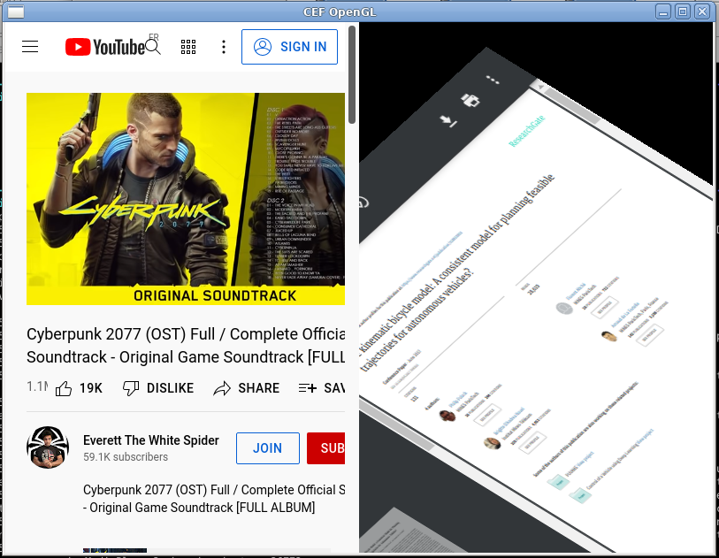
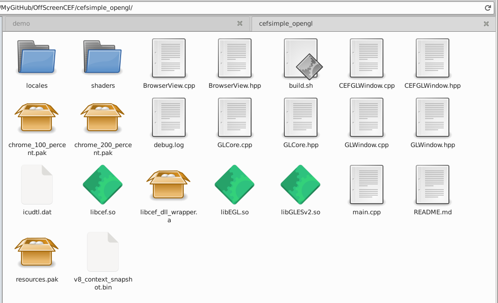

# Chromium Embedded Framework's cefsimple Off-Screen Rendering using SDL2 or Core OpenGL

CEF = Chromium Embedded Framework

For a GitHub project using Godot Engine (not yet in public access), I needed to prototype and modify the C++ CEF example named [cefsimple](https://bitbucket.org/chromiumembedded/cef/wiki/Tutorial) instead of X11 I needed using either SDL2 or OpenGL Core (glew, glfw3). I tried the following GitHub repos but without success:
- SDL2: https://github.com/gotnospirit/cef3-sdl2
- SDL2: https://github.com/jamethy/sdl2-cef
- OpenGL Core: https://github.com/if1live/cef-gl-example
- OpenGL Core: https://github.com/andmcgregor/cefgui

They are outdated (more than > 4 years), the CEF API changed, and when I compiled they crash by forking indefinitely the application until my Linux fell down. So they are not safe to be used! When starting, CEF will create several forks and needs to access the command line (`main(int argc, char* argv[])`) to give commands to the child process. From memory, issues of these repos come from the fact that the CEF API has evolved, and the command line access has been broken and as consequence, CEF is forking forever. In this repo is the updated version of these repos. They are inside the following folders:
- cefsimple_sdl: using SDL2.
- cefsimple_opengl: using OpenGL Core (>= 3.3).
- cefsimple_separate: with two separated processes. Two processes are needed when CEF cannot directly access the `main(int argc, char* argv[])` function of your application. You have to know that CEF modifies the content of your `argv` and this may mess up your application if it also parses
the command line (you can back it up, meaning using a `std::vector` to back up `argv` and after CEF init to restore values in `argv`). What is "two separated process" exactly ? Just an extra fork: the main process forks itself and call the secondary process, which can fully access to its own `main(int argc, char* argv[])`. The main constrain is the path of the secondary process shall be **canonic** (and this is a pain to get the real path). Do we really require two separated process ? See CEF for Unreal Engine: https://github.com/oivio/BLUI calling https://github.com/ashea-code/BluBrowser.

[](https://youtu.be/8xhxiDI4D5o)

*Fig 1 - The OpenGL version. Click on the image to see the youtube video of the demo.*

In this screenshot, you can see two browsers: one running YouTube, the second running a PDF (the projection of the mouse to the PDF plan has not been made).

**Note 1:** The keyboard/mouse event conversion from SDL2/glfw3 to CEF has to be fixed. **Update:** I have a functional keyboard for Godot/CEF and I have to patch this repo for SDL and glfw3 (request me if you needed it urgently).

**Note 2:** I find the system not very reactive compared to the official cefsimple example.

## Help wanted

Any pull requests and help are welcome to improve these examples :)
You can achieve the API by adding more methods such as previous/next page, reload, zoom ... See https://github.com/oivio/BLUI

## Tested on

It's working on my Linux 64-bits Debian 11 and CEF 99 downloaded at https://cef-builds.spotifycdn.com/index.html
I know the Windows version can work quite easily but I did not have batch files.
The MacOS X is more complex and is not working yet.

## Some Differences

- Note: all these codes are quick and dirty since I needed to check how to make CEF running with OpenGL or SDL2 before switching to Godot Engine.
- `cefsimple_sdl` is a single main file, while cefsimple_opengl has been split into several files.
- `cefsimple_sdl` is using more handlers such as `CefLifeSpanHandler`. cefsimple_opengl does not.
- `cefsimple_opengl` is using many viewports. cefsimple_sdl not. Viewport allows to place the web page where you want on the screen (in the screenshot, you can see two browsers: one running YouTube, the second running a PDF).
- `CefExecuteProcess` shall be called before OpenGL/SDL2 context and using the command line
of your application (`int argc, char* argv[]`). If not, your system can freeze. Here is the
function documentation (`caf_app.h` file):

```
   This function should be called from the application entry point function to
   execute a secondary process. It can be used to run secondary processes from
   the browser client executable (default behavior) or from a separate
   executable specified by the CefSettings.browser_subprocess_path value. If
   called for the browser process (identified by no "type" command-line value)
   it will return immediately with a value of -1. If called for a recognized
   secondary process it will block until the process should exit and then return
   the process exit code. The |application| parameter may be empty. The
   |windows_sandbox_info| parameter is only used on Windows and may be NULL (see
   cef_sandbox_win.h for details).
```
- In `cefsimple_sdl` and `cefsimple_opengl`, both programs can access to the `main(int argc, char* argv[])` function and therefore access to the command line. CEF; when forking; modifies the command lines to give behaviors to forked child. Sometimes, accessing to the main function is not possible (or when your application is also using the command line, while possible to save and restore it before and after calling CEF). Therefore, you shall launch a second process which can access its main function and therefore call chromium. As consequence, `cefsimple_separate` has been added when you cannot modify the main application to access to the `int main(int argc, char* argv[])` function.

## How to compile this project ?

Run the bash script for Linux:
```
./install.sh
```

This script will:
- download CEF inside the `thirdparty/` folder,
- use the CEF CMake to compile libraries and assets,
- copy them inside the `build/` folder,
- and compile my applications into the `build/` folder.

Once done with success, you have to go inside the `build/` folder and run one of the following applications:
- `./secondary_process`
- `./primary_process`
- `./cefsimple_opengl`
- `./cefsimple_sdl`

## Details on what the installation script is doing

To compile my applications, some libs and packages are needed: we have to compile them from CEF's example named `cefsimple` (OffScreenCEF/thirdparty/cef_binary/tests/cefsimple/ once downloaded). These libs and assets shall be in the same folder that the application binary (some internal configuration can change the path of some of them, but not all of them). We beware, some lib can be > 1 Gigabyte (depends on the operating system).

Here what the script is doing, but we will explain it manually.

Firstly, let name some folders. This will shorter code in this document. Adapt the CEF version to your operating system with the desired version according to https://cef-builds.spotifycdn.com/index.html

```bash
TMP=/tmp
CEF_LINK=https://cef-builds.spotifycdn.com/cef_binary_96.0.14%2Bg28ba5c8%2Bchromium-96.0.4664.55_linux64.tar.bz2
CEF=$TMP/cef_binary_96.0.14+g28ba5c8+chromium-96.0.4664.55_linux64
CEF_TARBALL=$CEF.tar.bz2
CEFSIMPLE_SDL=$CEF/tests/cefsimple_sdl
CEFSIMPLE_GL=$CEF/tests/cefsimple_opengl
```

Download and decompress it inside a temporary folder:

```bash
wget -c $CEF_LINK -O- | tar -xj
```

Git clone this repo inside the cef folder:

```bash
cd $CEF
git clone https://github.com/Lecrapouille/OffScreenCEF.git --depth=1
```

Compile CEF. This takes some minutes (not hours that would be needed if you had to compile CEF from sources):

```bash
mkdir $CEF/build
cd $CEF/build
cmake -DCMAKE_BUILD_TYPE=Debug ..
make -j$(nproc)
```

`$(nproc)` is your number of CPU cores. You can use `-DCMAKE_BUILD_TYPE=Release` instead but just avoid mixing debug and release symbols. Now we have to copy needed elements for compiling `cefsimple_sdl` and `cefsimple_opengl` and making them running:

```bash
cp -v $CEF/Debug/libcef.so $CEF/build/libcef_dll_wrapper/libcef_dll_wrapper.a $CEFSIMPLE_SDL

(cd $CEF/build/tests/cefsimple/Debug/
 cp -v icudtl.dat resources.pak chrome_100_percent.pak chrome_200_percent.pak v8_context_snapshot.bin $CEFSIMPLE_SDL
)

mkdir -p $CEFSIMPLE_SDL/locales
cp -v $CEF/build/tests/cefsimple/Debug/locales/en-US.pak $CEFSIMPLE_SDL/locales
```

Do the same thing for `$CEFSIMPLE_GL`. See the screenshot for needed assets (note this screenshot is old: in latest version of
this repo all assets and libs are no longer inside the code source but inside the `build/` folder with the binary of applications):



*Fig 2 - Needed assets from CEF.*

CEF needs all its assets next to it. Some paths can be configured. See OffScreenCEF/thirdparty/cef_binary/include/internal/cef_types.h for more information (once CEF downloaded by the install.sh script).

## How CEF works ?

The documentation of CEF is not really beginner friendly:
https://bitbucket.org/chromiumembedded/cef/wiki/GeneralUsage.md

You will have access to `int main(int argc, char * argv[])` else you will to deal with two separated process.
If you can access to `int main(int argc, char * argv[])`:

```
int main(int argc, char * argv[])
{
    // Start CEF by forking this current application. The access to argc, argv is mandatory
    // to allow passing information to forked CEF processes.
    CefMainArgs args(argc, argv);
    int result = CefExecuteProcess(args, nullptr, nullptr);
    if (result >= 0)
    {
        // The forked process has ended, so exit this application
        exit(result);
    }
    else if (result == -1)
    {
        // If called for the browser process (identified by no "type" command-line value)
        // it will return immediately with a value of -1
    }

    // Configure CEF see cef_binary/include/internal/cef_types.h for more information
    CefSettings settings;
    settings.windowless_rendering_enabled = true;
    if (!CefInitialize(args, settings, nullptr, nullptr))
    {
        return EXIT_FAILURE;
    }

    // CEF started with success.
    // Code for OpenGL/SDL2 init and runtime loop comes here after this line.
    ...

    // End of your application
    return EXIT_SUCCESS;
}
```
For rendering the web document, check out the code with:

```
class RenderHandler: public CefRenderHandler { ...
```

Two important methods to override:
- The GetViewRect that will get the region of your texture/windows and inform CEF. For a full page:

```
virtual void GetViewRect(CefRefPtr<CefBrowser> browser, CefRect& rect) override
{
    rect = CefRect(0, 0, m_width, m_height);
}
```

- When CEF has done some content to make you render:

```
virtual void OnPaint(CefRefPtr<CefBrowser> browser, PaintElementType type,
                     const RectList &dirtyRects, const void* buffer,
                     int w, int h) override
```

The `buffer` contains the image of the whole web page in the form BGRA8 (beware this is Blue-Green-Red-Alpha not Red-Green-Blue and 1 byte by chanel!).
The buffer size is w, h:

```
int const COLOR_CHANELS = 4;
int const SIZEOF_COLOR = COLOR_CHANELS * sizeof(char);
int const TEXTURE_SIZE = SIZEOF_COLOR * width * height;
```

Color conversion BGRA8 -> RGBA8: swap B and R channels can be made with:

```
for (int i = 0; i < TEXTURE_SIZE; i += COLOR_CHANELS)
{
    std::swap(w[i], w[i + 2]);
}
```

The dirtyRects contains a list dirty region to refresh. This avoids repainting the entire texture.

You can derive some CEF classes to override some of their methods to react to events such as a browser is created, closed,
page loaded ...

```
class BrowserClient: public CefClient,
                     public CefLifeSpanHandler,
                     public CefLoadHandler
{ ...
```

To create of a browser, the following code is needed:

```
CefBrowserSettings browserSettings;
browserSettings.windowless_frame_rate = 60; // 30 is default

CefWindowInfo window_info;
window_info.SetAsWindowless(0);

CefRefPtr<CefBrowser> browser;
browser = CefBrowserHost::CreateBrowserSync(
            window_info,
            browserClient.get(),
            "https://duckduckgo.com/",
            browserSettings,
            nullptr, nullptr);
```

CEF needs to be feed with mouse position, keyboard pressed, window reshaped ...
For example, for the mouse:

```
CefMouseEvent evt;
evt.x = from_sdl2_mouse.x;
evt.y = from_sdl2_mouse.y;
m_browser->GetHost()->SendMouseMoveEvent(evt, mouse_leave);
```

## Other projects

- For C++/Qt: https://github.com/CefView/CefViewCore
- For C++/Python: https://github.com/cztomczak/cefpython
- For C#/Unity: https://github.com/Voltstro-Studios/UnityWebBrowser
